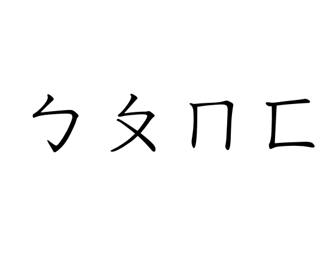

# Bopomofo-snippet

Alfred snippet for *Bopomofo*, or *Zhùyīn Fúhào*, with an introduction to their history.

There are (will be) two alfred snippet files in this repository, with Pinyin and W-G as the keywords respectively. I have also done a Greek alphabet snippet, see [Greek-Alphabet-Alfred-Snippet](https://github.com/BaksiLi/Greek-Alphabet-Alfred-Snippet).

Download: 
- [Bopomofo (Pinyin code)](https://github.com/BaksiLi/Bopomofo-snippet/blob/master/Bopomofo.alfredsnippets)
- (Update Pending) [Bopomofo (Wade–Giles)]()

# Introduction
What is Bopomofo and its compatibility with Pinyin and Wade–Giles

## History

## Comparison

## Modifications

# Troubleshooting

# Acknowledgement
This repository is licenced under the Creative Commons *Attribution-NonCommercial-NoDerivatives 4.0 International* License.  

Copyright (c) 2019 BaksiLi
